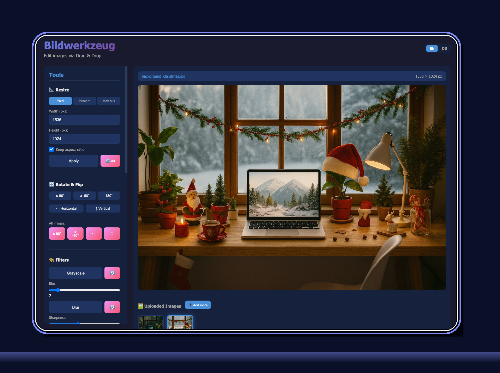

# 🖼️ Bildwerkzeug

A simple, web-based image editing tool with drag & drop functionality and optional user management.



## ✨ Features

- **📁 Drag & Drop Upload** - Upload multiple images at once
- **📐 Resize** - By pixels, percentage, or maximum file size
- **🔄 Rotate & Flip** - 90°, -90°, 180° rotation and mirroring
- **🎨 Filters** - Grayscale, blur, sharpen
- **⚡ Adjustments** - Brightness, contrast, saturation
- **✂️ Crop** - Crop images to desired area
- **�� Batch Processing** - Edit all images at once
- **💾 Export** - Download as PNG, JPEG, or WebP (single or ZIP)
- **🔐 Optional Login** - Secure authentication with admin panel
- **👥 User Management** - Admin can create and manage users
- **🌐 Multilingual** - German and English
- **🐳 Docker-ready** - Multi-arch images (amd64/arm64)

## 🚀 Quick Start with Docker

```bash
# Start with Docker Compose
docker compose up -d

# Open http://localhost:5050
# Login: admin / admin123
```

Or directly with Docker:

```bash
docker run -d \
  -p 5050:5000 \
  -e SECRET_KEY=your-secret-key \
  -e ADMIN_PASSWORD=secure-password \
  -v bildwerkzeug_data:/app/data \
  -v bildwerkzeug_uploads:/app/uploads \
  --name bildwerkzeug \
  ghcr.io/needful-apps/bildwerkzeug:latest
```

## 💻 Local Installation

1. **Python 3.8+** required

2. **Clone repository:**
   ```bash
   git clone https://github.com/needful-apps/Bildwerkzeug.git
   cd Bildwerkzeug
   ```

3. **Create virtual environment:**
   ```bash
   python3 -m venv venv
   source venv/bin/activate  # macOS/Linux
   # or: venv\Scripts\activate  # Windows
   ```

4. **Install dependencies:**
   ```bash
   pip install -r requirements.txt
   ```

5. **Start server:**
   ```bash
   python app.py
   ```

6. **Open browser:** [http://localhost:5056](http://localhost:5056)

## ⚙️ Configuration

Environment variables can be set in `.env`:

| Variable | Description | Default |
|----------|-------------|---------|
| `SECRET_KEY` | Flask Secret Key | `dev-secret-key-...` |
| `LOGIN_REQUIRED` | Require login? | `true` |
| `ADMIN_USERNAME` | Admin username | `admin` |
| `ADMIN_PASSWORD` | Admin password | `admin` |
| `ADMIN_EMAIL` | Admin email | `admin@localhost` |
| `DATABASE_URL` | Database URI | `sqlite:///bildwerkzeug.db` |
| `MAX_UPLOAD_MB` | Max upload size (MB) | `50` |
| `SESSION_LIFETIME_HOURS` | Session duration (hours) | `24` |

### Anonymous Mode

For public use without login:

```bash
LOGIN_REQUIRED=false
```

Images are then stored temporarily per browser session and automatically deleted after 24 hours.

## 📁 Project Structure

```
Bildwerkzeug/
├── app.py                 # Flask Backend
├── config.py              # Configuration
├── models.py              # Database models
├── requirements.txt       # Python dependencies
├── Dockerfile             # Docker image
├── docker-compose.yml     # Docker Compose
├── .env.example           # Example environment variables
├── templates/
│   ├── index.html         # Main page (Editor)
│   ├── login.html         # Login page
│   └── admin.html         # Admin panel
└── static/
    ├── style.css          # CSS Styles
    ├── script.js          # JavaScript Frontend
    ├── translations.js    # Translations (DE/EN)
    └── favicon.ico        # Favicon
```

## 🐳 Docker

### Image from GitHub Container Registry

```bash
# Pull latest image
docker pull ghcr.io/needful-apps/bildwerkzeug:latest

# For ARM (Raspberry Pi, Apple Silicon)
docker pull ghcr.io/needful-apps/bildwerkzeug:latest --platform linux/arm64
```

### Build locally

```bash
docker build -t bildwerkzeug .
```

## 🛠️ Technologies

| Area | Technology |
|------|------------|
| Backend | Python, Flask, Flask-Login, Flask-SQLAlchemy |
| Database | SQLite |
| Image Processing | Pillow (PIL) |
| Frontend | HTML5, CSS3, Vanilla JavaScript |
| Deployment | Docker, Gunicorn |
| CI/CD | GitHub Actions |

## 📄 License

MIT License - see [LICENSE](LICENSE) for details.
